# 32bit_ALU 设计文档
使用Verilog语言结构化描述方式设计一个32位ALU，具有32位无符号数加法、逻辑运算、移位、截断等功能。

# 项目简述

## 项目环境与描述方式

**设计语言：** Verilog硬件描述语言
**开发环境：** Vivado 2019.2
**测试环境：** LS-CPU-EXB-002实验箱，搭载Xilinx Artix-7 xc7a200tfbg676-2
**描述方式：** 结构化描述方式

## 设计目标

使用Verilog语言结构化描述一个32位ALU，具有以下功能：

- 32位无符号数加法
- 32位无符号数移位、32位无符号数截断
- 32位数逻辑与、32位数逻辑或、32位数逻辑非、32位数逻辑异或

## 实现情况

将上述功能集成至一个顶层模块中，其中顶层模块包括：

| **输入变量** |                                       |
| :----------- | ------------------------------------- |
| [31:0] a     | 32位操作数1                           |
| [31:0] b     | 32位操作数2                           |
| CI           | 1位进位输入，用于加法初始进位         |
| [2:0] F      | 3位输入，用于功能选择                 |
| [1:0] dir    | 2位输入，用于移位或截断方向的选择     |
| [4:0] bite   | 5位输入，用于移位位数或截断位数的选择 |
| **输出变量** |                                       |
| [31:0] S     | 32位输出，用于输出结果                |
| CO           | 1位输出，用于加法结果第33位进位输出   |

# 实现细节

## 主要模块

### 加法模块

加法模块采用了组间、组内并行的超前进位方式设计

首先构造出一个1-bit全加器，在构建一个4-bit CLA组件，通过整合四个1-bit全加器和一个4-bit CLA组件，得到一个4-bit超前进位加法器。在使用四个4-bit超前进位加法器，整合而成一个16-bit超前进位加法器，最后使用两个16-bit超前进位加法器即可完成32-bit超前进位加法器。
其中，超前进位模块在运算时为每一位计算提供CI的进位信息，相比较行波进位的方式，该方式能有效控制由于门电路堆叠造成的延迟时间。

#### 具体原理：

设二进制加法器第 i 位为Ai，Bi，输出为Si，进位输入为Ci，进位输出为C(i+1)，则有：
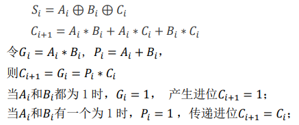

**四位超前进位模块公式：**

**四位超前进位模块：**
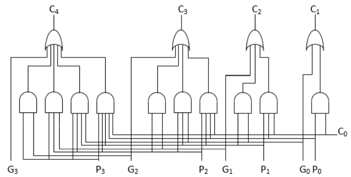

**四位超前进位加法器**
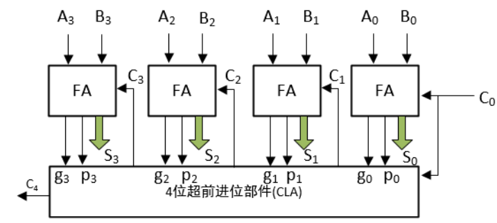

**封装后的四位超前进位加法器：**
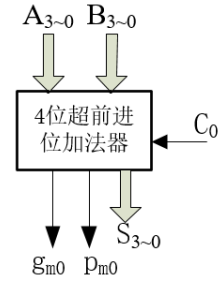

**因为**
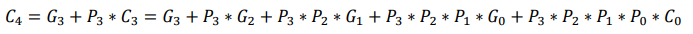
**通过类比法可得：**
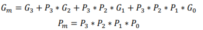

**十六位超前进位加法器：**
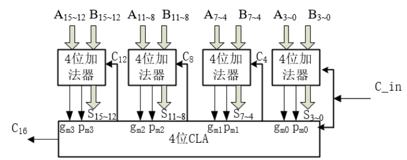

**三十二位超前进位加法器：**
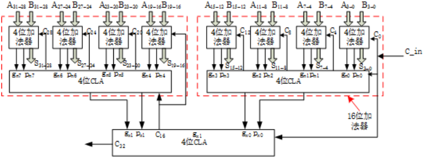

### 移位模块

采用门电路设计，由 1bit 移位模块、2bit 移位模块、4 bit 移位模块、8 bit 移位模块、16 bit 移位模块共五个模块构成 32 位移位模块。

移位功能分为四种不同的类型，分别为逻辑左移、逻辑右移、循环左 移和循环右移。
根据输入的两位操作数 dir 来调用不同的功能，之后再根据输入的 5 位操作数 bite 来判断移位的位数，移位位数范围从 0 到 31。

- 逻辑左移： dir 取 00。将目标数向左移动，最低位补 0。 
- 逻辑右移： dir 取 10。将目标数向右移动，最高位补 0。 
- 循环左移： dir 取 01。将目标数循环左移，右侧用原符号位补齐。
- 循环右移： dir 取 11。将目标数循环右移，左侧用原符号位补齐。

#### **具体原理：**

**shifter_1bit：**  
**译码器：**
将输入的 2 位操作数 dir 通过译码器，输出接 wire [3:0] f，作为 功能使能信号,输出的 4 种组合中，每一种组合中只有一位输出为 1，其余三 位输出为 0。 
**循环左移：**
将 32 位输入信号与功能信号 f[0],移位使能信号 enable 相与，结 果错位输出，错位距离为 1bit，例：输入第 30 位接输出第 31 位。 
**循环右移：**
基本同循环左移，功能信号为 f[2],需更改错位的方向，例：输入 第 31 位接输出第 30 位。 
**逻辑左移：**
功能信号为 f[1],移位后溢出的位直接丢弃，空余的位接 0 信号输 出，输入输出的每一位对应方法同循环左移。
**逻辑右移：**
功能信号为 f[3],基本同逻辑左移，只需更改接相应输入输出每一 位对应的方法。

 **shifter_2bit、shifter_4bit、shifter_8bit、shifter_16bit：** 基本同上， 只需将输入输出的错位距离更改为 2、4、8、16 位即可。

### 截断模块

本项目实现的截断功能是从目标数中截取出指定位数数据，其余位数上数据置 0。 
功能分为了两种不同的类型，分别为从左（高位）截取和从右（低位）截 取。
根据输入的两位操作数 dir 来调用不同的功能，之后再根据输入的 5 位操作数 bite 来判断截取的位数，截取位数范围从 1 到 32，截位始端都从目标数左端或右 端开始。

- **从右截取：** dir取00。
- **从左截取：** dir取10。

#### 具体原理：

**译码器：**
将输入的 5 位操作数 bite 通过译码器，输出的 32 种组合中，每一种组合中 只有一位输出为 1，其余输出为 0。输出的 32 种组合与输入的 5 位变量的最小项 一一对应。
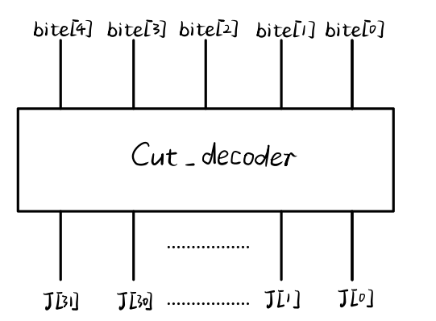

**从右截取：**  
in 端口输入 0，若 J[n]为 1，则 J[n-1]…J[0]对应的或门输出结果都为 1，将 输出结果与输入的目标数 1 按位相与，输出 s。J[31]…J[n+1]所对应的输出都 被置为 0，而 J[n]…J[0]对应的输出保持原样。
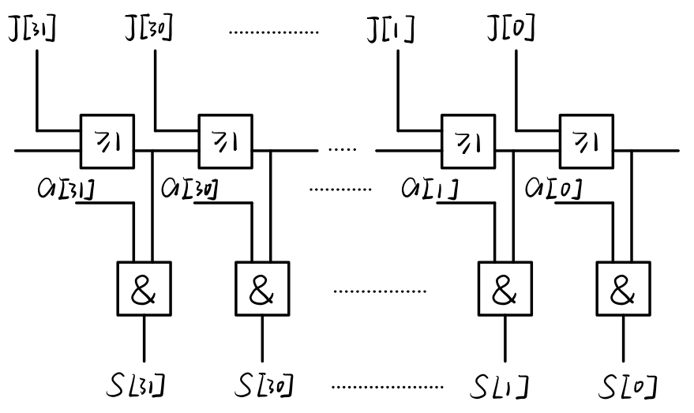

**从左截取：**
in 端口输入 0，若 J[n]为 1，则 J[n-1]…J[0]对应的或门输出结果都为 1，将 输出结果与输入的目标数 1 按互补位相与，输出 s。J[n-1]…J[0]所对应的输出 都被置为 0，而 J[31]…J[n]对应的输出保持原样。

### 逻辑与

实现两个给定 32 位目标数之间的与运算，输出 32 位与运算后的结果。 输入两个目标数 a、b,输出结果 s。 

**具体原理：**

### 逻辑或

实现两个给定 32 位目标数之间的或运算，输出 32 位或运算后的结果。 输入两个目标数 a、b,输出结果 s。

**具体原理：**
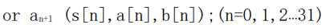

### 逻辑非

实现一个给定 32 位的非运算，输出 32 位非运算后的结果。 输入一个目标数 a，输出结果 s。

**具体原理：**
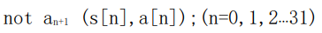

### 逻辑异或

实现两个给定 32 位目标数之间的异或运算，输出 32 位异或运算后的结果。 输入两个目标数 a、b,输出结果 s 

**具体原理：**
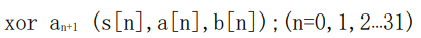

### 译码器

输出的 8 种组合与输入的 3 位变量的最小项一一对应。

| 输入 |      |      | 输出 |      |      |      |      |      |      |      |
| ---- | ---- | ---- | ---- | ---- | ---- | ---- | ---- | ---- | ---- | ---- |
| F2   | F1   | F0   | Y0   | Y1   | Y2   | Y3   | Y4   | Y5   | Y6   | Y7   |
| 0    | 0    | 0    | 1    | 0    | 0    | 0    | 0    | 0    | 0    | 0    |
| 0    | 0    | 1    | 0    | 1    | 0    | 0    | 0    | 0    | 0    | 0    |
| 0    | 1    | 0    | 0    | 0    | 1    | 0    | 0    | 0    | 0    | 0    |
| 0    | 1    | 1    | 0    | 0    | 0    | 1    | 0    | 0    | 0    | 0    |
| 1    | 0    | 0    | 0    | 0    | 0    | 0    | 1    | 0    | 0    | 0    |
| 1    | 0    | 1    | 0    | 0    | 0    | 0    | 0    | 1    | 0    | 0    |
| 1    | 1    | 0    | 0    | 0    | 0    | 0    | 0    | 0    | 1    | 0    |
| 1    | 1    | 1    | 0    | 0    | 0    | 0    | 0    | 0    | 0    | 1    |

### 顶层ALU模块

首先设计实现不同功能的子模块，之后将这些子模块例化，集成到至同一个顶 层模块 ALU 中，然后设计译码器模块，通过译码器输入的不同来实现不同的子模 块的调用，从而实现不同的功能。 

| **输入变量** |                                       |
| :----------- | ------------------------------------- |
| [31:0] a     | 32位操作数1                           |
| [31:0] b     | 32位操作数2                           |
| CI           | 1位进位输入，用于加法初始进位         |
| [2:0] F      | 3位输入，用于功能选择                 |
| [1:0] dir    | 2位输入，用于移位或截断方向的选择     |
| [4:0] bite   | 5位输入，用于移位位数或截断位数的选择 |
| **输出变量** |                                       |
| [31:0] S     | 32位输出，用于输出结果                |
| CO           | 1位输出，用于加法结果第33位进位输出   |
| **功能选择** |                                       |
| F:000        | 无功能，此项输出 ffffff               |
| F:001        | 加法功能                              |
| F:010        | 移位功能                              |
| F:011        | 截断功能                              |
| F:100        | 逻辑与                                |
| F:101        | 逻辑或                                |
| F:110        | 逻辑非                                |
| F:111        | 逻辑异或                              |

# 明细表

| 模块名         | 模块输入                                                     | 模块输出                                          | 描述                     |
| -------------- | ------------------------------------------------------------ | ------------------------------------------------- | ------------------------ |
| ALU_Display    | *                                                            | *                                                 | 顶层模块，调用多个子模块 |
| ALU_32bit      | a:(32bit)目标数1、 b:(32bit)位目标数2、 CI:加法初始进位、 F:(3bit)功能选择、 dir:(2bit)移位或截断使用、 bite:(5bit)位数选择 | S:(32bit)结果输出、 CO:加法结果进位          | 顶层模块，调用多个子模块 |
| Decoder_3To8   | a:(3bit)顶层模块 、F输入                                     | y:(8bit)与子模块输出相与                          | 译码器                   |
| CLA_Add_32bit  | A:(32bit)目标数 1 输入、 B:(32bit)目标数 2 输入、 CI:初始进位输入 | S:(32bit)加法结果输出、 CO:加法结果进 位输出 | 超前进位加法器           |
| Shifter_32bit  | a:(32bit)目标数1输入、 dir:(2bit)方向或功能判断、 bite:(5bit)移位位数 | result:(32bit)移位结果输出                        | 移位模块                 |
| Decoder_2To4   | a:(2bit)移位器子模块dir输入                                  | y:(4bit)与子模 块目标数 1 相与                    | 译码器                   |
| Truncate_32bit | a:(32bit)目标数1输入、 dir:方向判断、 bite:(5bit)位数确定 | s:(32bit)截断结果输出                             | 截断模块                 |
| Cut_decoder    | bite:(5bit)位数输入                                          | judge:(32bit) 译码结果输出                        | 截断模块子模块           |
| CutL           | dir:作为0使用、 a:目标数1输入、  judge:(32bit)译码结果输入 | s:(32bit)从左端点开始截断结 果输出                | 左截断                   |
| CutR           | dir:取反，作为 0 使、 a:目标数1输入、 judge:(32bit)译码结果输入 | s:(32bit)从右端点开始截断结果输出                 | 截断器子模块：从右截断   |
| And_32bit      | a:(32bit)目标数 1 输入、 b:(32bit)目标数 2 输入         | s:(32bit)逻辑与结果输出                           | 逻辑与                   |
| Or_32bit       | a:(32bit)目标数 1 输入、 b:(32bit)目标数 2 输入         | s:(32bit)逻辑或结果输出                           | 逻辑或                   |
| Not_32bit      | a:(32bit)目标数 1 输入                                       | s:(32bit)逻辑非结果输出                           | 逻辑非                   |
| Xor_32bit      | a:(32bit)目标数 1 输入、 b:(32bit)目标数 2 输入         | s:(32bit)逻辑异或结果输出                         | 逻辑异或                 |
